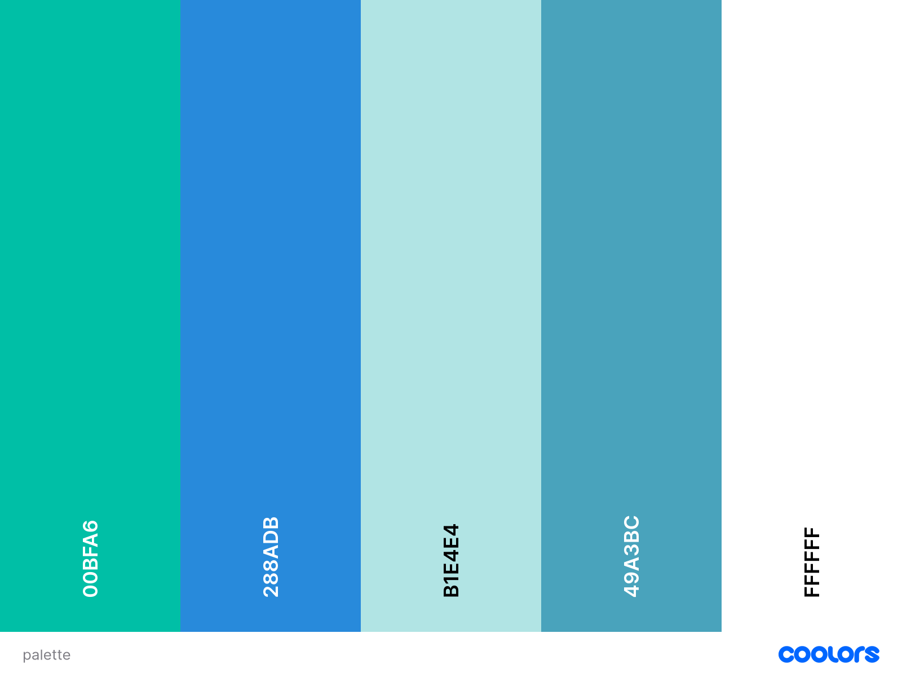
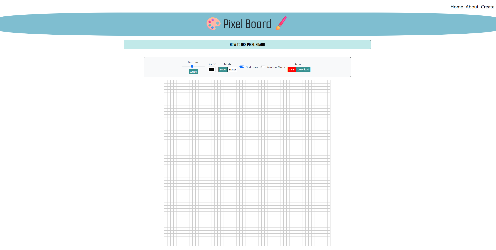
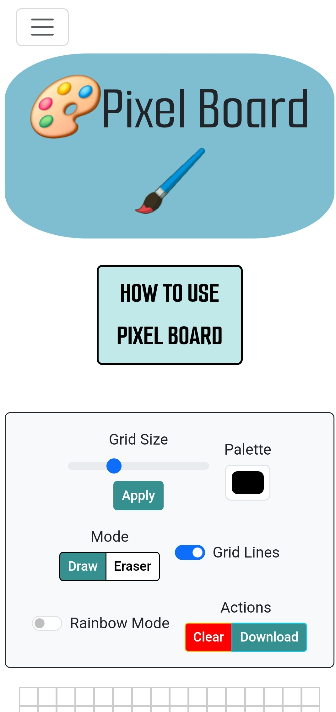
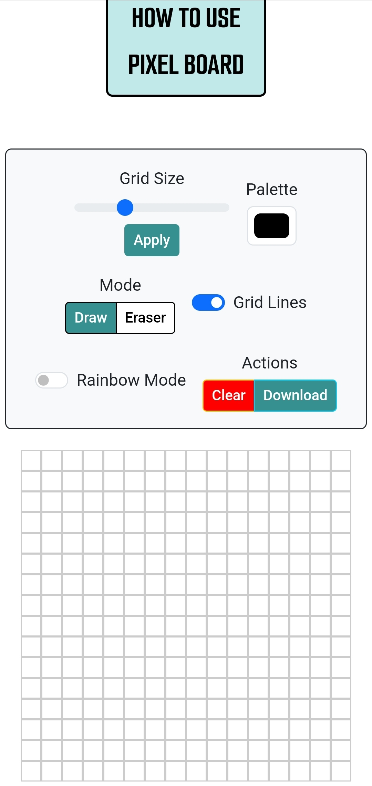
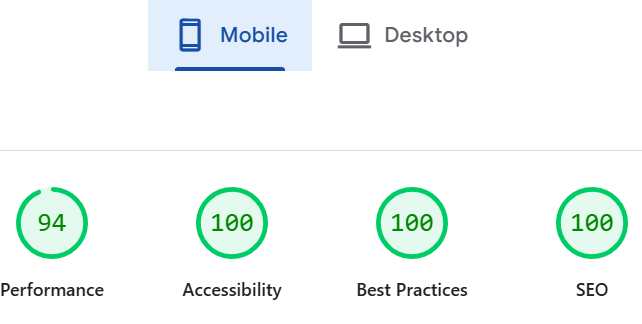
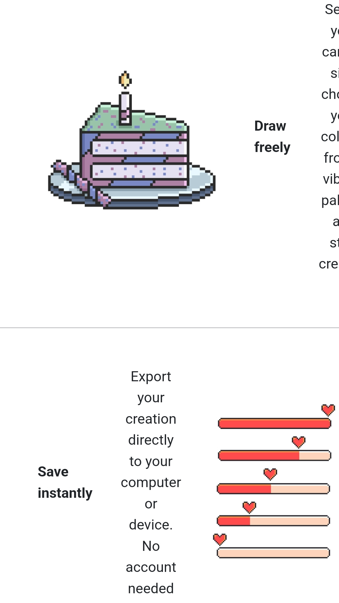
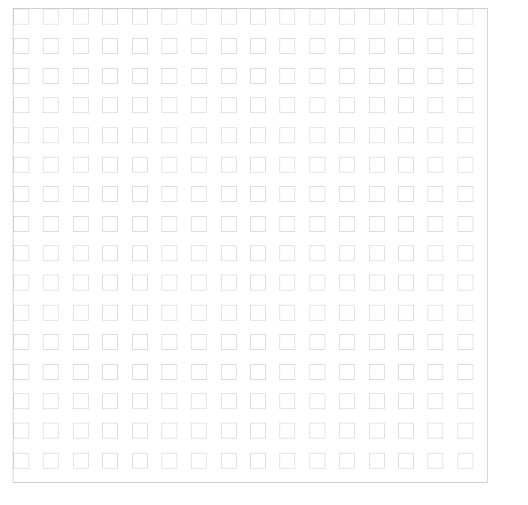
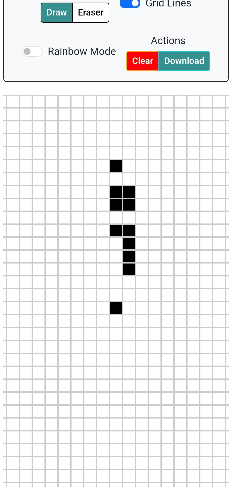

# Overview
Pixel Board is a browser-based pixel art creator that allows users to make and download pixel images directly to their devices. Designed with simplicity in mind, the site requires no installation or account creation allowing users to create pixel art with ease

# User Stories

#### User Goals
- To be able to draw onto a blank canvas to create custom images
- To be able to access and use the website seamlessly across different devices
- To be able to delete specific parts of the drawing without having to clear the whole board, whilst having the option to clear the whole board if needed
- To be able to save my image to my device
- To be able to quickly access a pixel drawing tool without having to make an account
- To be able to remove grid lines to have a clearer view of my final image
- To be able to adjust the size of the canvas to suit my needs

#### Returning User Goals

# Wireframes 
[Balsamiq](https://balsamiq.com) has been used to create a visual plan for the website layout. A wireframe has been created for mobile, desktop and tablet to ensure a uniform design is maintained, as well as functionality.

#### Home Page

#### About Page

#### Create Page

# Design
#### Colour Scheme
[Coolors](https://coolors.co/) has been used to create a colour palette. Calming tones have been intentionally selected to align with the relaxing nature of Pixel Board

#### Typograhpy
[Google Fonts](https://fonts.google.com/) has been used to add a more pixelated font in main areas of the website in the form of 'Smooch Sans'. This suits the retro nature of pixel art whilst looking clear for users to read
#### Imagery

# General Features
Pixel Board is a browser-based tool that allows users to create pixel art using an interactive, customisable grid canvas. Built with HTML, CSS (including Bootstrap), and JavaScript, this responsive web app adapts seamlessly to both desktop and mobile devices. It includes intuitive drawing tools, colour customisation, and image export capabilities.

### Home Page
#### Desktop

#### Mobile

 
### About Page
#### Desktop

#### Mobile

 
### Create Page
#### Desktop

#### Mobile

 

# Functionality

Several features have been considered to optimise user experience, whether they're using the website on Desktop or Mobile. Each feature has been planned with different interfaces in mind to ensure that each website feature runs smoothly and is easy to use

#### Responsive Navbar
- In desktop view, the navbar is positioned to the top-right of the screen. It is easy to identify without interrupting the website content. Text has been kept black for a simplistic appearance but changes to teal when hovered over to match the overall theme of the site 
 

- In mobile view, the navbar collapses and forms a dropdown menu on the top-left corner of the screen, identifiable through a burger button. There is an unfolding transition when the button is pressed to reveal the rest of the pages available

 

#### "Create Pixel Board Now" Button

- A button saying "create pixel board now" has been placed on the homepage in order for users to have a quick and alternative method of accessing the pixel board. As this is the core component of the website, it enables users to find the pixel board easily without relying on the navigation bar. The create page is accessible through the navivation bar, but this enables users to get to the "create" page quickly without having to read content
- In both mobile view and desktop view, the button is large and bold to enable users to see it clearly
#### Desktop

#### Mobile

 

#### Link to board on "about" page
- At the bottom of the content, there is a sentence with a link to the pixel board. This is aimed at users who want to read the information about Pixel Board first, and then want to try it out

 

#### Modal on "Create" Page

#### Board Controls on Pixel Board

#### Future Implementations

# Technologies Used

# Testing
### Lighthouse Testing
[Lighthouse](https://chromewebstore.google.com/detail/lighthouse/blipmdconlkpinefehnmjammfjpmpbjk) is a Chrome extension which enables the performance of each page to be analysed. The results for each page can be seen below:

#### Desktop

Home Page

About Page

Create Page

#### Mobile

Home Page

About Page

Create Page

 

# Bugs

### Resolved 

Text and images out of place on Home Page. This was resolved by altering image size and reducing by 50px due to use of flexbox/justify-content/space-between 

 

When first deployed, images were not showing on Github Pages despite showing in VS Code Live Preview. This was due to inconsistencies with file names, as one images folder was capitalised and one was not. As Github Pages is case sensitive, this meant that images did not show. New folders were made to align with the Github repository and this issue was then resolved

A closing curly bracket was initially missed in this CSS declaration, which altered the overall layout of the page and meant that flexbox classes changed as a result. Curly brace added to reolve layout issue

Pixels had gaps between them in the board but been reconfigured to sit alongside eachother to form a functional pixelboard

 

The pixel board had a border in place at all times that didn't correspond with the size of the board. Border properties were investigated and ammended so that this is not visable

 

Initially, the grid size slider only improved functionality for the desktop site but made little difference to mobile. Further javascript was required in order for the grid to adjust to different screen sizes. Now the slider makes a grid that is appropriate for the screen it is being used on

 

 When scrolling the pixel board on mobile, it automatically drew on the board and ruined existing pixel art. This resolved by adding touchstart and touchmove event listeners in javascript. Initially this did not work so ammendments were made to the code

Initially, when scrolling, the board would be drawn on as shown below. This no longer happens and users are able to scroll if they have selected a board size that requires it

This line of code was preventing scrolling on touch when pixel board used on mobile

# Accessibility

# Deployment
- The site has been deployed using Github pages as follows:
  In the GitHub repository, navigate to the Settings tab 
  - From the source section drop-down menu, select the Master Branch
  - Once the master branch has been selected, the page will be automatically refreshed with a detailed ribbon display to indicate the successful deployment.

# Credits
### Images
- [Favicon for Title](https://favicon.io/emoji-favicons/artist-palette)

### Additional Resources
