# **Pixel Board**

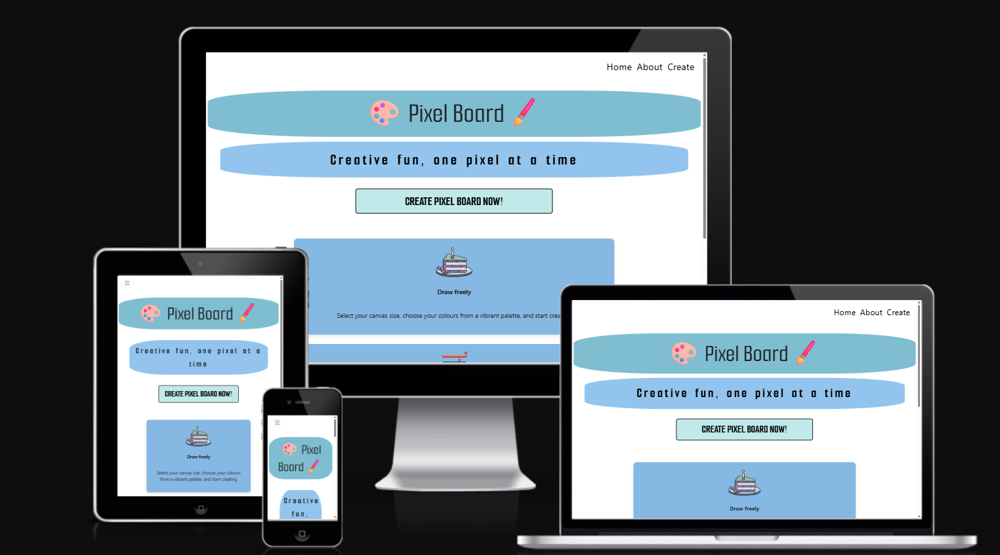

# Overview
Pixel Board is a browser-based pixel art creator that allows users to make and download pixel images directly to their devices. Designed with simplicity in mind, the site requires no installation or account creation allowing users to create pixel art with ease

# User Stories

#### User Goals
- To be able to draw onto a blank canvas to create custom images
- To be able to access and use the website seamlessly across different devices
- To be able to delete specific parts of the drawing without having to clear the whole board, whilst having the option to clear the whole board if needed
- To be able to save my image to my device
- To be able to quickly access a pixel drawing tool without having to make an account
- To be able to remove grid lines to have a clearer view of my final image
- To be able to adjust the size of the canvas to suit my needs

#### Returning User Goals

- To be able to customize and switch between different canvas sizes quickly for varied projects.
- To be able to toggle grid lines on and off seamlessly to focus on details or overall image clarity.
- To be able to selectively erase parts of the drawing without disrupting other areas.
- To be able to save multiple versions of my artwork and easily download them as PNG files.
- To be able to use the pixel drawing tool smoothly across devices, including mobile and desktop, without creating an account.
- To be able to toggle color palettes and modes (e.g., rainbow mode) for more creative freedom.
- To be able to clear the canvas quickly when starting fresh, without affecting other settings or preferences.

# Wireframes 
[Balsamiq](https://balsamiq.com) has been used to create a visual plan for the website layout. A wireframe has been created for mobile, desktop and tablet to ensure a uniform design is maintained, as well as functionality.

#### Home Page

#### About Page
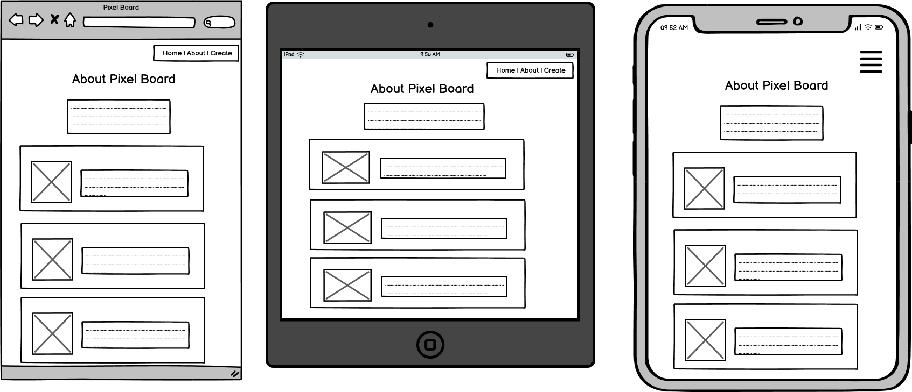

#### Create Page

# Design
#### Colour Scheme
[Coolors](https://coolors.co/) has been used to create a colour palette. Calming tones have been intentionally selected to align with the relaxing nature of Pixel Board

#### Typograhpy
[Google Fonts](https://fonts.google.com/) has been used to add a more pixelated font in main areas of the website in the form of 'Smooch Sans'. This suits the retro nature of pixel art whilst looking clear for users to read

#### Imagery

- [Free Icons](https://freeicons.io/) has been used to create favicons

- Images have been selected to fit into the colour scheme of the website. The chosen images depict what a user can create using pixel art and a variety of concepts have been included. All images are referenced in the "credits" section of this document. 

# General Features
Pixel Board is a browser-based tool that allows users to create pixel art using an interactive, customisable grid canvas. Built with HTML, CSS (including Bootstrap), and JavaScript, this responsive web app adapts seamlessly to both desktop and mobile devices. It includes intuitive drawing tools, colour customisation, and image export capabilities.

### Home Page
#### Desktop
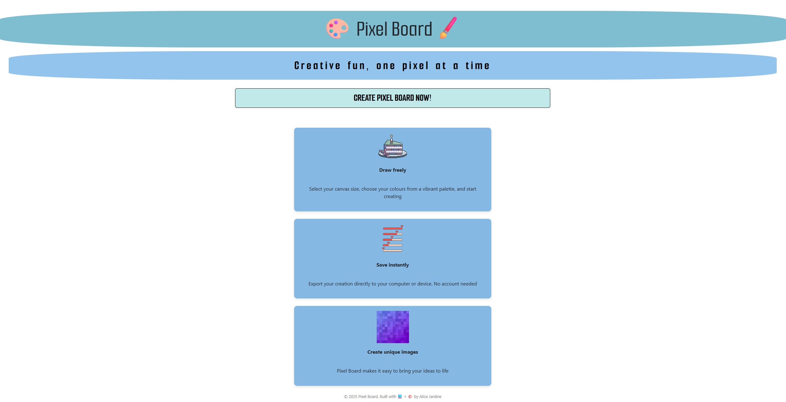
#### Mobile
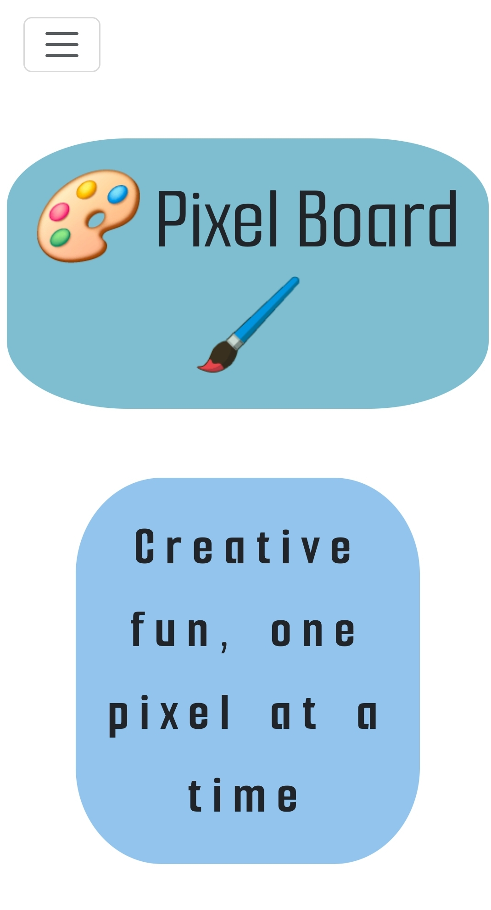
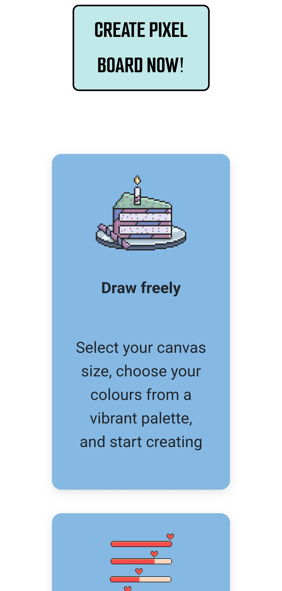
 
### About Page
#### Desktop

#### Mobile

 
### Create Page
#### Desktop

#### Mobile

 

# Functionality

Several features have been considered to optimise user experience, whether they're using the website on Desktop or Mobile. Each feature has been planned with different interfaces in mind to ensure that each website feature runs smoothly and is easy to use

#### Responsive Navbar
- In desktop view, the navbar is positioned to the top-right of the screen. It is easy to identify without interrupting the website content. Text has been kept black for a simplistic appearance but changes to teal when hovered over to match the overall theme of the site 
 

- In mobile view, the navbar collapses and forms a dropdown menu on the top-left corner of the screen, identifiable through a burger button. There is an unfolding transition when the button is pressed to reveal the rest of the pages available
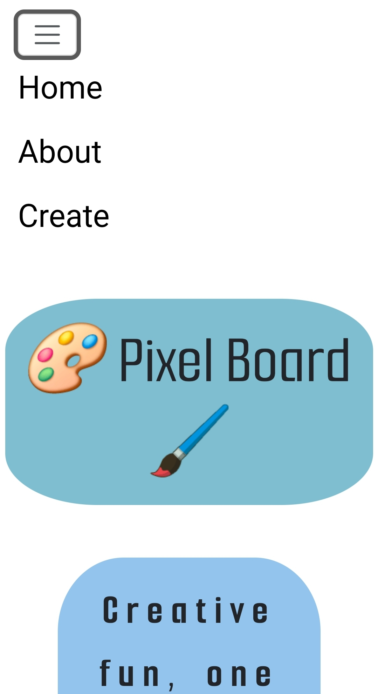

 

#### "Create Pixel Board Now" Button

- A button saying "create pixel board now" has been placed on the homepage in order for users to have a quick and alternative method of accessing the pixel board. As this is the core component of the website, it enables users to find the pixel board easily without relying on the navigation bar. The create page is accessible through the navivation bar, but this enables users to get to the "create" page quickly without having to read content
- In both mobile view and desktop view, the button is large and bold to enable users to see it clearly
#### Desktop

#### Mobile

 

#### Link to board on "about" page
- At the bottom of the content, there is a sentence with a link to the pixel board. This is aimed at users who want to read the information about Pixel Board first, and then want to try it out

 

#### Modal on "Create" Page

- A modal has been created using [bootstrap](https://getbootstrap.com/docs/5.3/components/modal/) to provide a user guide about feautres of the pixel board. It is viewable through pressing a button called "how to use pixel board" giving users a choice to read about the features before they begin using it. The button styling is the same as the "create pixel board now" button on the homepage for uniform design. When hovered over, the background colour becomes a darker shade of its current colour, and the font changes to white
- On desktop, the modal is presented as a long piece of text where scrolling is not necessary. On Mobile, the modal is scrollable in order to make the information clear in its presentation

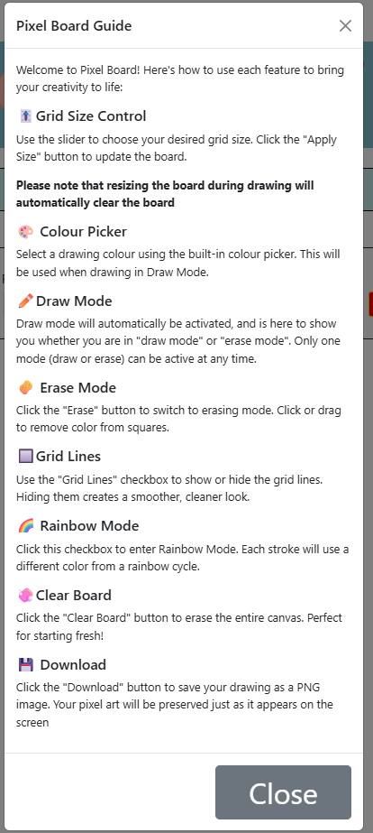
 
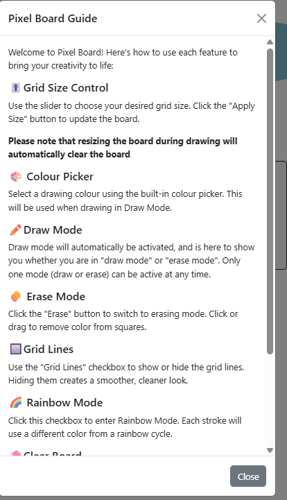
 

#### Board Controls on Pixel Board

- [Bootstrap](https://getbootstrap.com/docs/5.3/components/list-group/) has been used to place the pixel board controls within a horizontal list. This enables each item to be clearly presented as well as fully responsive. In the "mode" section of the board, there are two buttons whereby only one can be active at any given time. This is shown clearly through highlighting the button currently in use. The "clear" button has been styled as red to show users that this will delete everything on the board. Toggles have been used for "grid lines" and "rainbow mode" so that it is clear to users whether these modes are on or not

##### Desktop

##### Mobile

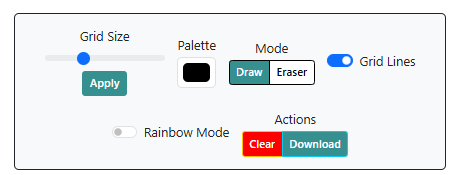

 

#### Future Implementations

- Save a pixel board to be able to return later and continue with it. This would enable users to not have to finish what they've started without losing content
- Look into the image not being cleared when the board size is changed to enable users to play around with board sizing whilst creating
- A submit section where users can submit their pieces to be displayed on a gallery page
- Video guides on how to achieve more complex design ideas

# Technologies Used

- [Visual Studio](https://visualstudio.microsoft.com/) was used for writing code
- [Bootstrap](https://getbootstrap.com/) was used to create a responsive navbar and responsive grid layout on the "create" page controls section
- [Github](https://github.com/) was used to store code & deploy website
- [Balsamiq](https://balsamiq.com) was used to create wireframes
- [Adobe Express](https://www.adobe.com/express/feature/image/resize) was used for image resizing

### Languages Used
- HTML5
- CSS3
- Javascript
 

# Testing
### Lighthouse Testing
[Lighthouse](https://chromewebstore.google.com/detail/lighthouse/blipmdconlkpinefehnmjammfjpmpbjk) is a Chrome extension which enables the performance of each page to be analysed. The results for each page can be seen below:

#### Desktop

Home Page

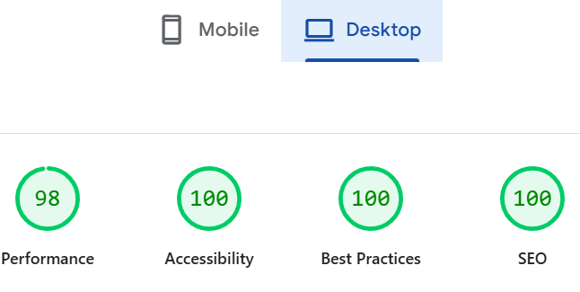

About Page

Create Page

#### Mobile

Home Page

About Page

Create Page

 

### Validation

HTML validation was carried out using the [W3C Markup Validation Service](https://validator.w3.org/#validate_by_input). Reports for each page can be seen below:

Home Page

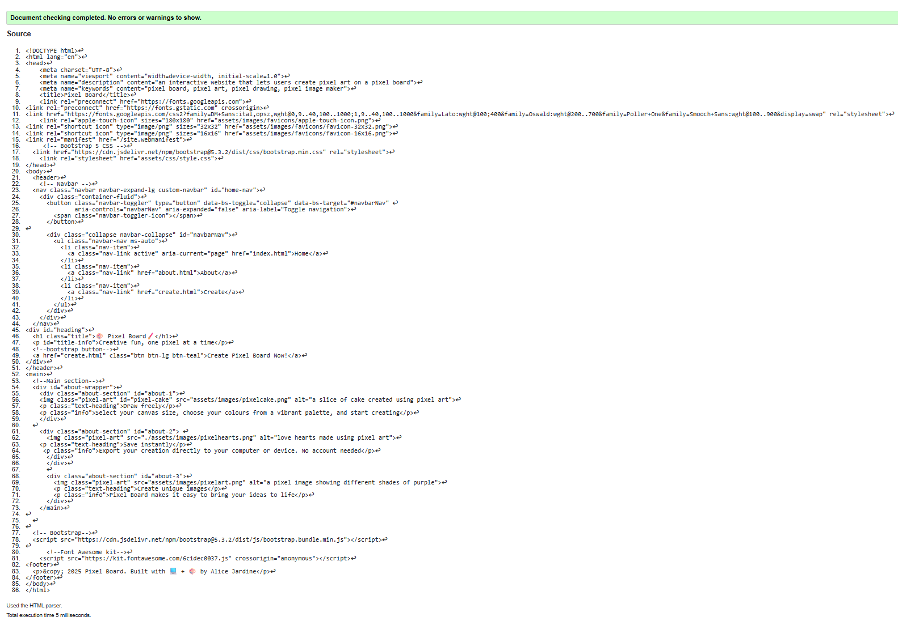

 

About Page

Initially, error messages were detected as images had "max width" and "max height" properties. This has been deleted following validation and there are now no errors

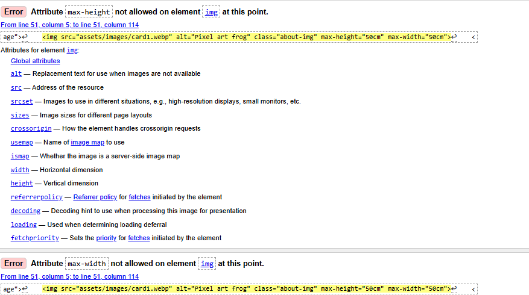
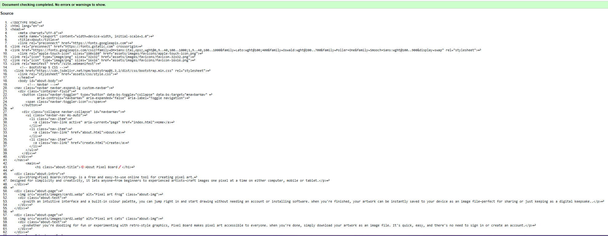

 

Create Page

Initially, the following errors were shown:

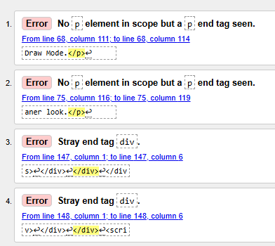

 
These have now been ammended and there are no errors

 

Javascript

[JSHint](https://jshint.com/) has been used to validate the javascript code. Following research, the following comment needed to be added to the top of the code to ensure that modern javascript is being considered:

 

The following errors were then shown:

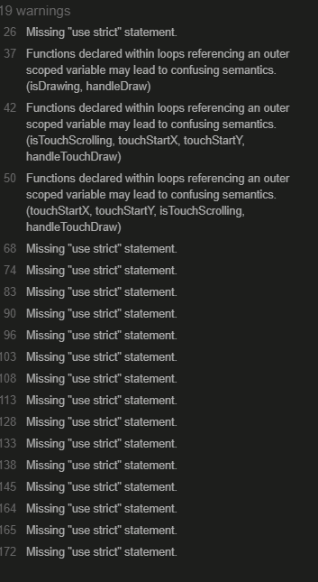

 

Research was then carried out on functions declared in loops and how this is not best practice. Alterations were made to the code, and now the only error showing is the comment required at the top for an accurate report

 

 

CSS Validation

The [W3C CSS Validation Service](https://jigsaw.w3.org/css-validator/validator) was used to validate CSS code. The following errors were found:

 

These have since been resolved and now no errors are found

### Manual Testing

#### Navigation

| Feature                | Test Case                  | Outcome                          |
|------------------------|----------------------------|----------------------------------|
| Navbar Links           | Clicked on navbar          | Took user to intended page       |
| Navbar on Mobile       | Clicked burger button      | Navbar drops down                |
| About Page Nav Link    | Hovered over link          | Link changes colour              |
| About Page Nav Link    | Clicked link               | Taken to "create" page           |

#### Home Page

| Feature                | Test Case                  | Outcome                          |
|------------------------|----------------------------|----------------------------------|
| Create Pixel Board Btn | Hover over button          | Font and background color change |
| Create Pixel Board Btn | Clicked button             | Taken to "create" page           |

#### Create Pixel Board Page

| Feature                | Test Case                          | Outcome                          |
|------------------------|------------------------------------|----------------------------------|
| Create Page Button     | Hovered over button                | Font and background color change |
| Create Page Button     | Clicked button                     | Modal appears                    |
| Grid Size Slider       | Adjusted slider and pressed Apply  | Grid changes size                |
| Apply Button          | Hovered over button                | Font and background color change |
| Colour Palette         | Clicked colour palette             | Selection of colours to choose   |
| Draw/Eraser Button     | Clicked each button                | One active at a time             |
| Rainbow Mode Toggle    | Clicked toggle                    | Rainbow colour palette applied   |
| Clear Button          | Clicked button                    | Pixel board cleared              |
| Download Button       | Clicked button                   | Pixel board downloaded as PNG   |
| Pixel Board            | Clicked on pixel board            | Individual squares coloured in   |

 

### Browser Testing

| Browser                 | Outcome                                                     |
|-------------------------|-------------------------------------------------------------|
| Google Chrome           | Displays the website as intended, site is fully responsive and appearance is as intended |
| Microsoft Edge          | Displays the website as intended, site is fully responsive and appearance is as intended |
| Firefox                 | Displays the website as intended, site is fully responsive and appearance is as intended |
| Samsung Mobile Browser  | Displays the website as intended, site is fully responsive and appearance is as intended |

 

# Bugs

### Resolved 

Text and images out of place on Home Page. This was resolved by altering image size and reducing by 50px due to use of flexbox/justify-content/space-between 

 

When first deployed, images were not showing on Github Pages despite showing in VS Code Live Preview. This was due to inconsistencies with file names, as one images folder was capitalised and one was not. As Github Pages is case sensitive, this meant that images did not show. New folders were made to align with the Github repository and this issue was then resolved

A closing curly bracket was initially missed in this CSS declaration, which altered the overall layout of the page and meant that flexbox classes changed as a result. Curly brace added to reolve layout issue

Pixels had gaps between them in the board but been reconfigured to sit alongside eachother to form a functional pixelboard

 

The pixel board had a border in place at all times that didn't correspond with the size of the board. Border properties were investigated and ammended so that this is not visable

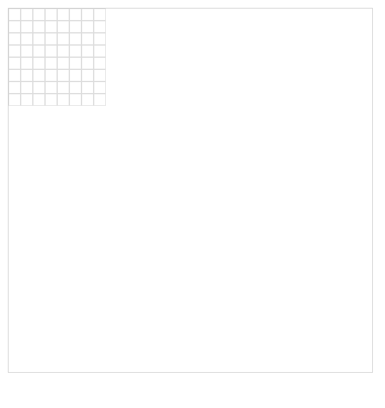

 

Initially, the grid size slider only improved functionality for the desktop site but made little difference to mobile. Further javascript was required in order for the grid to adjust to different screen sizes. Now the slider makes a grid that is appropriate for the screen it is being used on

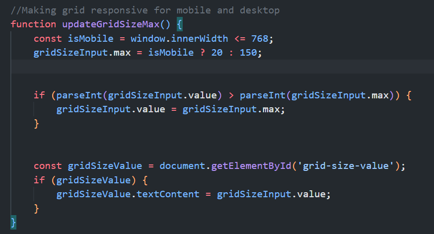
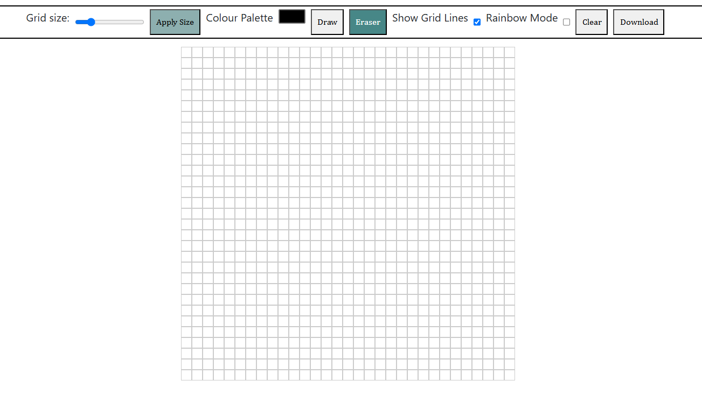
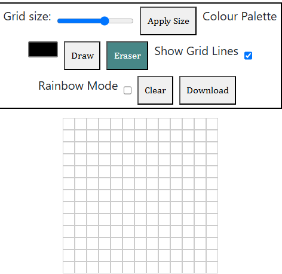

 

 When scrolling the pixel board on mobile, it automatically drew on the board and ruined existing pixel art. This resolved by adding touchstart and touchmove event listeners in javascript. Initially this did not work so ammendments were made to the code

Initially, when scrolling, the board would be drawn on as shown below. This no longer happens and users are able to scroll if they have selected a board size that requires it

This line of code was preventing scrolling on touch when pixel board used on mobile

 

### Unresolved

- The pixel board size changer on mobile does make the board viewable on screens, but it would be better if the size changes were in smaller increments

# Accessibility

- The Chrome extension [Wave](https://chromewebstore.google.com/detail/wave-evaluation-tool/jbbplnpkjmmeebjpijfedlgcdilocofh) has been used to provide visual feedback on the website

- The Chrome extension [Web Disability Simulator](https://chromewebstore.google.com/detail/web-disability-simulator/olioanlbgbpmdlgjnnampnnlohigkjla) has been used during building to enable consideration for how the website may be percieved for people with visual limitations

# Deployment
- The site has been deployed using Github pages as follows:
  In the GitHub repository, navigate to the Settings tab 
  - From the source section drop-down menu, select the Master Branch
  - Once the master branch has been selected, the page will be automatically refreshed with a detailed ribbon display to indicate the successful deployment.
 

# Credits

#### Inspiration 
- [Build Pixel Art Creator](https://www.youtube.com/watch?app=desktop&v=CxPc6_oX03o&t=54s) was used for board creation ideas
- [Make a Pixel Art Maker](https://www.youtube.com/watch?v=wZZyhrJxZRU&t=1s) was also used for board creation ideas
- [Build a Pixel Art Canvas](https://www.youtube.com/watch?v=X8QMrFHF69o) was also used for ideas
- [Code Club Projects](https://projects.raspberrypi.org/en/projects/pixel-art) was used to look into different ways of creating a pixel board
- [Dev](https://dev.to/0shuvo0/lets-create-a-pixel-art-maker-with-javascript-4016) was used to look into pixel board creation

## Images

### Title

- [Favicon for Title](https://favicon.io/emoji-favicons/artist-palette)
 

#### Home Page
- [Pixel Cake Image](https://pixabay.com/illustrations/cake-dessert-sweet-food-pastry-9126295/)
- [Pixel heart bars](https://www.shutterstock.com/search/16-bit-life-bar?image_type=illustration)
- [Purple pixels square](https://pixabay.com/vectors/pixel-square-background-rectangle-2790335/)

#### About Page

- [Pixel frog](https://www.teacherspayteachers.com/Product/Rhythm-Color-By-Note-Music-Activity-Frog-QuarterEighthRestHalf-Rest-11329424)
- [Pixel cats](https://uk.pinterest.com/pin/220465344253904137/)
- [Pixel flowers](https://in.pinterest.com/pin/877990889858593834/)

 

### Additional Resources

- [Code Academy](https://www.codecademy.com/) has been used for additional javascript learning
- [Stack Overflow](https://stackoverflow.com/questions) has been used to research javascript components
- [W3 Schools](https://www.w3schools.com/) has been used for coding practice
- [JS Hint](https://jshint.com/) was used for javascript validation
- [W3C CSS Validation Service](https://jigsaw.w3.org/css-validator/validator) was used for CSS validation
- [W3C Markup Validation Service](https://validator.w3.org/) was used for HTML validation
- [Markdown Cheatsheet](https://github.com/adam-p/markdown-here/wiki/markdown-cheatsheet) for writing markdown reference
